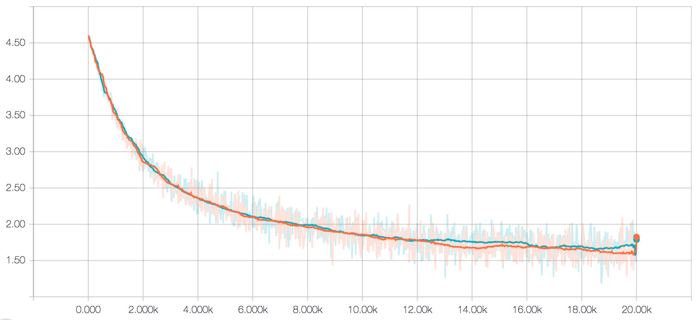

# Meal recognition
Judy Xu, David Zhu, and Jonah Spear
Comp Robo 2017

## Overview
The goal of this project was to programmatically label food images. Although this task is relatively easy for humans, is difficult for machines. Recognizing foods in an image is the first step towards developing an algorithm to count calories, which would be useful for diabetics and people looking to develop healthy eating habits. Our pipeline worked as follows:

For example, given an image of ice cream, it outputs the probability of the top five classes.

In this case, it correctly identified it as ice cream.

## Plate Isolator.
The step in our data pipeline was to isolate just the food in an image with possibly many visual features. Inspired by [DeepFood](https://arxiv.org/abs/1606.05675), where they manually drew a bounding box for increased performance. Our method crops the image automatically by leveraging a common trait in many food images - that the food is on an ellipsoid or circular plate. We implemented the method presented in [Nie et al 2013](https://www.ncbi.nlm.nih.gov/pmc/articles/PMC3739713/).

Our method for plate isolation comprises of four main steps:
Pre-process images and isolate the longest edges
Generate random points on this edges  and find the normals on those edges.
Group normals that point towards each other.
Find the biggest group of normals. Draw an ellipse through those points.

## Datasets
There were several datasets that we explored while going through this project. Two that we primarily focused on were [UEC256](http://foodcam.mobi/dataset256.html) and [Food101](https://www.vision.ee.ethz.ch/datasets_extra/food-101/) because of clean labeling and large datasets.

UEC256 is a dataset of Asian cuisine, curated by Yanai’s lab at the The University of Electro-Communications (Tokyo). Originally, we trained our models using this dataset because it was smaller, and we were training locally. However, the asian foods within their categories are new to us and are hard to distinguish by eye; UEC is recognized as one of the harder datasets to train on. After starting our training on Deepthought, we ported over to Food101.

Food101 is a food dataset of 101 food categories with 1000 images in each categories. The categories are diverse and includes food from several cultures and desserts, such as apple pie and chicken curry. The data set has the advantage of having a lot of images in each category and having categories that are distinct enough to make them easier to train.   

## Papers
The first part of our project involved reading papers from labs that also worked on food image recognition. Here are two of those papers which impacted our approach:

#### DeepFood: Deep Learning-based Food Image Recognition for Computer-aided Dietary Assessment
This paper utilized both UEC and Food101 for their datasets, and they were able to get competitive results with fine-tuning. Using Caffe and the model zoo, they were able to fine-tune an existing Inception model and get 76.3% top-1 accuracy in UEC100 (compared to 72.26% from prior methods) and 77.4% top-1 accuracy for Food101 (compared to 56.4% from leading competitor).

Because of this paper, we wanted to get into the same range of accuracy. This paper utilized fine-tuning, and they ran 300,000 iterations for Food101, which dramatically improved our own trained model.

#### Food Image Recognition using deep convolutional network with pre-training and fine-tuning

This paper demonstrated strong results (78.48% top-1 accuracy) on UEC100 data by combining a DCNN with other techniques. They also used fine-tuning by modifying an existing Krizhevsky network trained on ImageNet. They modified a latter fully-connected layer from 4096x1x1 to 6144x1x1, inspired by another paper that recommend “augmenting additional categories related to the target recognition task”. Originally, the network outputs 1000 categories, and by expanding the prior hidden layer, they could augment the final layer to 2000 categories (more specific to food). This was then pre-trained and narrowed to the 100 UEC categories. They also included a non-food category to help with Twitter mining.

What’s interesting about this paper is that final layer modifications, especially augmenting existing layers with new nodes, can produce great results. It also posed an alternative to creating filters, and instead we can create additional categories that capture external cases (like non-foods).

## Training
Through our initial research, we learned about final layer re-training and fine-tuning as a viable way to quickly train a powerful deep convolutional neural network (DCNN). Training these large networks are incredibly time and computationally expensive, and at our turn-around we would not be able to train something fast and accurate enough from scratch. These alternative training methods are like tweaks to an existing trained model, where we can utilize the model’s existing ability to recognize patterns on general images.

### Inception
There are several great examples of final-layer retraining, where a network’s final classification layer is chopped off and re-implemented with a new set of classes. We followed Google’s documentation to retrain Inception V3, a DCNN trained on ImageNet, a large general image database. Compared to other networks, Inception is interesting because it is composed of Inception modules, which contain multiple convolutions and pooling concatenated together. (Other networks normally layer these serially).

We chose Inception over other models because of it’s good documentation and tutorials, as well its strengths in having a [lower memory and energy footprint](https://adeshpande3.github.io/adeshpande3.github.io/The-9-Deep-Learning-Papers-You-Need-To-Know-About.html).

*The layer groups of Inception.*

*These were the extra layers that facilitated retraining of the final softmax layer.*

### Analysis
Successfully training a model requires understanding on the results output from the training and evaluation process. These are a few concepts we need to understand to evaluate the quality of a network.

##### Accuracy
The accuracy is the percentage of the images in a batch that were labeled with the correct class.

##### Cross-validation
Normally in machine learning a set of data is divided into 2 batches, one for training and one for testing. Cross-validation means using rounds of different partitions of training and testing sets and then averaging the accuracy value across the rounds.  

##### Loss
The loss function is error function that depends on each weight between each layer of the network.  The error is a quantitative measure of how much the predicted label differ from the actual label. Training the model involves minimizing the loss function.

##### Cross-entropy
Cross-entropy is a loss function that gives a glimpse into how well the learning process is progressing. More specifically, it is measured as the distance between two probability vectors, namely, the predicted probability vector and the label vector. A lower cross entropy is better.

##### Precision
In machine learning, precision is the ratio of true positives to all identified positives (sum of true positives and false positives). It measures how many items selected are actually relevant. For example, if our model identified 8 images as strawberry shortcake but 3 of them are actually apple pie, the precision would be ⅝. Precision measures how useful the prediction is.

##### Recall
Recall is the ratio of true positives to all actual positives. It measures what fraction of relevant images are selected and how complete the prediction is.

##### Sparsity
Sparsity occurs when among all the coefficients in a model, only a few are non-zero. This improves performance, as not all nodes need to be activated to produce a good result.

Luckily, the Google team also built Tensorboard, and web tool that visualizes data output from a Tensorflow session. These are seen in the following selected versions trained of Food 101.

#### V2 and V3
These models are run by retraining only the final softmax layer. After getting several hyperparameters figured out, our V2 model ran for 10,000 iterations at a 0.003 learning rate.

##### V2 accuracy

##### V2 cross-entropy

V2 took 20 minutes to run on Deepthought and its top-1 accuracy is around 54%. The cross entropy has not plateaued significantly, so we decided to train V3 longer.

V3 ran for 20,000 iterations at 0.005 learning rate. The training took 40 minutes with these results:

##### V3 accuracy

##### V3 cross-entropy

Top-1 accuracy is at ~60% (a 5% improvement), and cross entropy decreased from 2.1 to 1.8. At this point, the cross-entropy loss function does look like it has been plateauing, and so we assumed that this is as far as final-layer training would get us and that we would need to try alternative methods.

#### V4
By revisiting the DeepFood paper, we saw that their model can do 77.4% top-1 accuracy after 250,000 iterations on Food-101. (Note that this was through fine-tuning, which trains the whole model). Inspired by this, V4 (using original methods) ran for 250,000 iterations at a 0.01 learning rate.

##### V4 accuracy

##### V4 cross entropy

After over eight hours of training, we were able to see another 8% increase in accuracy, up to ~68%. We were excited about this result because it demonstrated what just re-training 1 layer could do to the model. We were also entering the ballpark of existing papers. To improve even further, we started exploring how fine-tuning the whole model can help with food recognition. The alternative approach is to retrain deeper levels, but we were unsuccessful in repurposing existing inception code to do so.

#### V5 - Fine-tuning approach
In fine-tuning, the final layer is repurposed just like before. However, all nodes in the network are available for tweaking. Because of this, fine-tuning is more expensive than just re-training the final layer, and we could only run our model 44,000 cycles after 26 hours. Additionally, the fine-tuning scripts did not offer running training and evaluation at the same time.

##### V5 total loss (cross-entropy) for training

##### V5 Weights sparsity

After running evaluations, we see that the top-1 precision is 0.684 and top-5 recall is 0.889 on 50016 examples. This do seem like promising figures, but when we ran our modified `label_image` script several times, the predictions are much worse than the prior results. This could be because of incorrect hyper-parameters or not enough training duration.

## Code structure

`dcnns` contains scripts that train and validate our model. This trained models are then referenced in `meal_recognition`, which contains the full pipeline.
Inside `meal_recognition`, we used functions in different scripts and imported them across scripts. Each function has its own purpose, from using tensor flow to label images, to cropping a image after detecting plates, to graphing.

## Challenges
Because none of us had much machine learning experience, getting into this project was fairly difficult. It was challenging to determine a good starting place or even determine if the project was feasible. To tackle this, we read through many papers and tutorials. During this process, we discovered the training methods done in this project, and we had to find good resources along the way.

Google’s Inception model offered a good place to start because of their documentation and tutorials. It was educational training our models based on their re-training procedure. However, it became much more difficult to dive into the inner workings of Inception to make deeper modifications. A lot of time was dedicated just to parse through all the code that composes inception, its training and evaluation procedure, and what to do after the model is trained.

Furthermore, one of the biggest challenges was understanding the core concepts of machine learning and DCNNs. This knowledge is important in helping us determine whether a model is training properly and if further changes are required.

## Lessons learned
Did you learn any interesting lessons for future robotic programming projects? These could relate to working on robotics projects in teams, working on more open-ended (and longer term) problems, or any other relevant topic.

Some of the learnings in process include server and local workflows. Sinces models are expensive to train, we utilized Olin’s Deepthought to carry out our training. This required some balance between syncing code on the server and the client. Some of the things we used include [sshfs](https://github.com/libfuse/sshfs) which allowed us to mount remote drives locally (so we could use GUI applications) and [tmux](https://tmux.github.io/) to create persistent sessions for running our models and hosting Tensorboard.

Another big learning comes from utilizing existing code and a jumping-off point for a new project versus writing code from scratch. Using existing code is useful for us to get good results when tackling a large image recognition problem. However, trying to modify existing code to do additional work required much deeper research into the code. While it was educational, every time we wanted to do something more complex it was hard to make a change that was useful as a result. For longer term projects, I definitely recommend playing with existing codebases because we did find it educational to learn how complex models are built and tested.

## Future work

There were several directions which we researched/attempted that did not make the scope of our project because of debugging and training work. Given additional time, we would love to complete these:

##### T-SNE visualizations.
Analogous to PCAs as a way to represent multidimensional data in lower dimension space, this technique would visually enhance the results of our models. Based on some articles, it seems that T-SNE performs better than PCA at revealing clusters. We couldn’t complete this because batch running our model was problematic, and this visualization could not directly improve our model. However, it would definitely make fine-tuning more understandable, as our fine-tuned model’s results definitely underperformed our understanding of the quantitative results.

##### Spatial transformer networks.
Additional ways for us to pre-process the input data is to train another network that normalizes our images for us. Spatial transformer networks can make the input more spatially invariant, which should make the whole network simpler to train.

##### Retraining deeper layers without fine-tuning the whole model.
Through learning deeper about SLIM, Google’s library for implementing DCNNs like Inception, we may be able to point to a deeper layer, set up a new bottleneck, and train the remaining Inception Module (mixed) layers. In the tutorial code, additional nodes were introduced that made this process seem pretty daunting. We were not able to figure it out, but this could be even more promising than fine-tuning.

##### Implement image segmentation to separate different foods.
Oval detection has helped identify plates, and additional preprocessing may separate different food items before sending them into the model.
